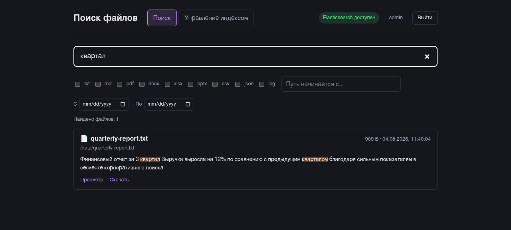
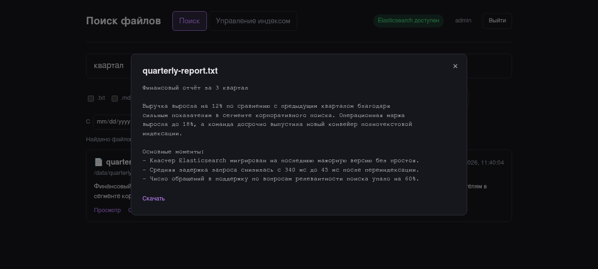
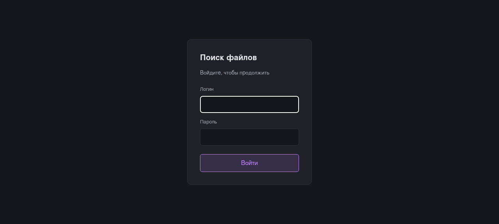
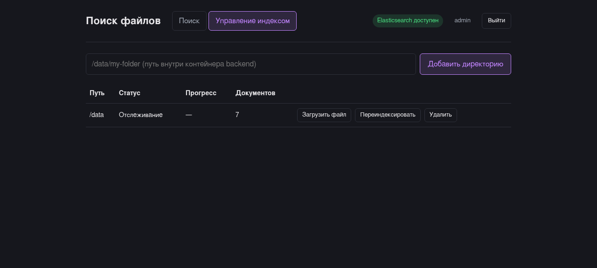

# Поиск файлов на диске (Spring Boot + React + Elasticsearch)

Приложение индексирует файлы на диске (текст, PDF, DOCX, XLSX, PPTX и др.) и даёт быстрый полнотекстовый поиск по содержимому с морфологией русского языка, подсветкой совпадений, предпросмотром и метаданными документов. Индекс остаётся актуальным в реальном времени: изменения файлов на диске (в том числе загруженных прямо через интерфейс) подхватываются автоматически, без ручной переиндексации.

Полная спецификация и обоснование архитектурных решений — в [SPEC.md](SPEC.md).

## Скриншоты

| Поиск | Предпросмотр |
|---|---|
|  |  |

| Вход | Управление индексом |
|---|---|
|  |  |

## Возможности

- Рекурсивная индексация одной или нескольких директорий
- Извлечение текста и метаданных (автор, заголовок, дата создания) из документов (PDF, DOCX, XLSX, PPTX, HTML и др.) через Apache Tika
- Морфологический поиск по русскому языку (Elasticsearch `russian` analyzer) — находит словоформы, а не только точное совпадение
- Живое отслеживание файловой системы (`WatchService`) — добавление/изменение/удаление файла обновляет индекс автоматически
- Полнотекстовый поиск с fuzzy-матчингом, фильтрами по расширению/пути/дате и подсветкой совпадений
- Поиск «по мере ввода» на фронтенде (debounce, без кнопки «Найти»)
- Предпросмотр файла (текст/PDF/изображение) и метаданных документа без скачивания
- Скачивание найденного файла по ссылке из результатов
- Загрузка новых файлов прямо через интерфейс — попадают в выбранную отслеживаемую директорию и индексируются автоматически
- Управление отслеживаемыми директориями (добавление/переиндексация/удаление) с живым статусом и прогрессом сканирования
- Вход по логину и паролю
- Иконки по типу файла, счётчик найденных результатов, тёмная тема по умолчанию
- Интерфейс на русском языке

## Стек

| Слой | Технологии |
|---|---|
| Backend | Java 21, Spring Boot 4.1 (Web, Security, Data Elasticsearch, Actuator, Validation), Gradle (Kotlin DSL), Apache Tika, Lombok |
| Поиск | Elasticsearch 9.x (через официальный `elasticsearch-java` клиент — прямые запросы с multi_match, fuzziness, highlighting, `russian` analyzer) |
| Frontend | React 19, TypeScript, Vite, обычный CSS (без UI-кита) |
| Тесты | JUnit 5, Testcontainers (реальный Elasticsearch), MockMvc, Spring Security Test — backend; Vitest, React Testing Library, msw — frontend |
| Инфраструктура | Docker Compose (Elasticsearch + backend + nginx-фронтенд) |

## Быстрый старт (Docker Compose)

Нужен установленный Docker.

```bash
docker compose up --build
```

Поднимутся три контейнера: `elasticsearch`, `backend` (порт `7007`) и `frontend` (порт `7006`, nginx с проксированием `/api` и `/actuator` на backend). По умолчанию в контейнер backend монтируется директория `./sample-data` (демонстрационные файлы всех поддерживаемых форматов на русском) как `/data` (на запись — загрузка файлов через UI пишет прямо в этот том).

Открыть приложение: **http://localhost:7006**

Данные для входа по умолчанию: **admin / admin** (переопределяются через `APP_AUTH_USERNAME`/`APP_AUTH_PASSWORD`, см. ниже).

Проиндексировать другую директорию с хоста:

```bash
INDEX_ROOT=/путь/к/вашим/файлам docker compose up --build
```

Зарегистрировать директорию для индексации можно либо через вкладку «Управление индексом» в UI, либо через API (сначала войти и сохранить сессионную куку):

```bash
curl -c cookies.txt -X POST localhost:7007/api/auth/login -d 'username=admin&password=admin'

curl -b cookies.txt -X POST localhost:7007/api/roots \
  -H 'content-type: application/json' \
  -d '{"path":"/data"}'

curl -b cookies.txt -G localhost:7007/api/search --data-urlencode 'q=Elasticsearch'
```

Остановить и удалить контейнеры (данные Elasticsearch останутся в volume):

```bash
docker compose down
```

Добавить `-v`, чтобы удалить и данные индекса.

## API

Все эндпоинты под `/api/**`, кроме `/api/auth/login` и `/api/auth/logout`, требуют аутентификации (сессионная кука).

| Метод | Путь | Назначение |
|---|---|---|
| `POST` | `/api/auth/login` | Вход (`username`/`password`, form-urlencoded) |
| `POST` | `/api/auth/logout` | Выход |
| `GET` | `/api/auth/me` | Текущий пользователь сессии (401, если не авторизован) |
| `POST` | `/api/roots` | Добавить директорию для отслеживания (`{"path": "/data"}`) |
| `GET` | `/api/roots` | Список отслеживаемых директорий со статусом/прогрессом |
| `GET` | `/api/roots/{id}` | Статус одной директории |
| `POST` | `/api/roots/{id}/reindex` | Полная переиндексация директории |
| `POST` | `/api/roots/{id}/upload` | Загрузить файл (multipart) в директорию — индексируется автоматически через `WatchService` |
| `DELETE` | `/api/roots/{id}` | Прекратить отслеживание и удалить документы из индекса |
| `GET` | `/api/search?q=&extension=&path=&from=&to=&page=&size=` | Полнотекстовый поиск с подсветкой |
| `GET` | `/api/files/{id}` | Метаданные и извлечённый текст файла (для предпросмотра) |
| `GET` | `/api/files/{id}/download` | Скачать оригинальный файл по id найденного документа |
| `GET` | `/api/files/{id}/preview` | Отдать файл inline (для рендера в браузере — PDF/изображения/текст) |
| `GET` | `/actuator/health` | Доступность приложения и Elasticsearch (открыт без авторизации) |

## Локальная разработка (без Docker)

Понадобится отдельно запущенный Elasticsearch 9.x на `localhost:9200`.

### Backend

```bash
cd backend
./gradlew bootRun
```

Backend поднимется на `localhost:8080`. Переменные окружения: `SPRING_ELASTICSEARCH_URIS`, `APP_CORS_ALLOWED_ORIGINS`, `APP_AUTH_USERNAME`, `APP_AUTH_PASSWORD` (см. `application.yml`).

### Frontend

```bash
cd frontend
npm install
npm run dev
```

Vite-сервер (`localhost:5173`) проксирует `/api/*` на `localhost:8080` (см. `vite.config.ts`).

## Тесты

```bash
# backend: юнит, @WebMvcTest и полный e2e-тест на Testcontainers с реальным Elasticsearch
cd backend && ./gradlew test

# frontend: Vitest + React Testing Library + msw
cd frontend && npm test
```

## Структура проекта

```
.
├── SPEC.md                 # подробная спецификация и архитектура
├── docker-compose.yml
├── backend/                 # Spring Boot API (индексация, поиск, скачивание, авторизация)
├── frontend/                 # React SPA (поиск, превью, управление индексом, загрузка)
├── sample-data/              # демонстрационные файлы всех форматов для docker compose up
└── docs/screenshots/         # скриншоты для этого README
```

## Безопасность

- Подсветка совпадений и извлечённый текст документа передаются с бэкенда не как сырой HTML, а как обычные текстовые данные (список фрагментов `{text, matched}` для подсветки, строка для превью) — фронтенд рендерит их как обычный React-текст, никогда через `dangerouslySetInnerHTML`. Даже если содержимое файла — валидный HTML/JS, оно не будет интерпретировано как разметка.
- Скачивание/предпросмотр файла адресуется по непрозрачному id документа (хэш пути), а не по сырому пути — это исключает path traversal за пределы проиндексированных файлов. Загрузка файлов также защищена от path traversal через имя файла.
- Авторизация — простой логин/пароль с одной демо-учётной записью (сессионная кука, `HttpOnly`, пароль хранится захешированным через BCrypt в памяти) для демонстрационных целей, не полноценная система пользователей и ролей. CSRF сознательно отключён — у приложения нет серверных форм и чувствительных операций, а сессионная кука `HttpOnly` уже защищает от кражи токена через XSS. Для продакшена стоит включить CSRF-защиту и заменить демо-аккаунт на полноценную систему пользователей.
